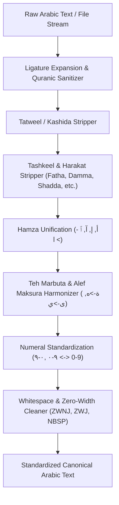

[🇸🇦 العربية](README.ar.md) | [🇬🇧 English](README.md)

# 🔤 eidcloud-arabic-normalizer

Enterprise-grade high-speed Arabic text normalization, diacritics sanitizer, and orthographic harmonizer in pure PHP 8.2+ with zero external dependencies.

[](https://github.com/eidcloud/eidcloud-arabic-normalizer/releases)
[](https://www.php.net/)
[](LICENSE)
[](notebooks/quickstart.ipynb)
[](.github/workflows/ci.yml)

---

## 📌 Topics
`eidcloud` • `arabic-nlp` • `text-normalizer` • `arabic-language` • `orthography` • `tashkeel-remover` • `php8`

---

## 🌟 Architecture & Pipeline



---

## ✨ Features & Capabilities

- **Zero External Dependencies**: Pure PHP 8.2+, relying only on standard native multibyte string operations (`mbstring`).
- **Complete Hamza Unification**: Harmonizes `أ`, `إ`, `آ`, `ٱ` into a single canonical Alef (`ا`), with optional normalization for `ؤ`, `ئ`, and isolated `ء`.
- **Comprehensive Tashkeel Processing**: Strips and isolates all Arabic diacritics: Fatha, Damma, Kasra, Sukun, Shadda, Tanwin (Fathatan, Dammatan, Kasratan), and Dagger Alef (`ـٰ`).
- **Tatweel (Kashida) Elimination**: Removes decorative elongation marks (`ـ`).
- **Orthographic Harmonization**: Standardizes Teh Marbuta (`ة` ↔ `ه`), Alef Maksura (`ى` ↔ `ي`), and Persian/Farsi Yeh (`ی` → `ي`).
- **Numeral Standardization**: Bidirectional conversion between Western Arabic digits (`0-9`), Eastern Arabic numerals (`٠-٩`), and Persian numerals (`۰-۹`).
- **Ligature & Quranic Sign Cleaning**: Expands presentation-form ligatures (`﷽`, `ﷺ`, `ﷲ`, `﷼`) and strips recitation/pause marks.
- **Gigabyte-Scale Stream Processing**: High-throughput buffered line-by-line processing for massive Arabic NLP corpora and database dumps.
- **Full CLI Suite**: Built-in `bin/eidcloud-ar-norm` command-line utility with JSON output and throughput telemetry.

---

## 🚀 Installation

Install via Composer into your PHP project:

```bash
composer require eidcloud/arabic-normalizer
```

Or clone the repository directly for zero-dependency standalone use:

```bash
git clone https://github.com/eidcloud/eidcloud-arabic-normalizer.git
```

---

## 💻 Programmatic Usage

### 1. Basic Normalization

```php
use EidCloud\ArabicNormalizer\Normalizer;

$normalizer = new Normalizer();

$raw = "بِسْمِ اللَّـهِ الرَّحْمَٰنِ الرَّحِيمِ ... أَنَا أُحِبُّ اللُّغَـةَ العَـرَبِيَّـةَ فِي سَنَةِ ٢٠٢٦م";
$clean = $normalizer->normalize($raw);

echo $clean;
// Output: بسم الله الرحمن الرحيم ... انا احب اللغه العربيه في سنه 2026م
```

### 2. Custom Orthographic Options

```php
use EidCloud\ArabicNormalizer\Normalizer;

$normalizer = new Normalizer([
    'keep_shadda' => true,           // Preserve Shadda (ّ)
    'teh_marbuta_to_heh' => false,   // Keep Teh Marbuta (ة) as-is
    'numeral_target' => 'eastern',    // Normalize digits to Eastern Arabic (٠-٩)
]);

$result = $normalizer->normalize("القُوَّةُ الضَّارِبَةُ رقم 123");
echo $result;
// Output: القوّة الضّاربة رقم ١٢٣
```

### 3. Diacritics Extraction

```php
$diacritics = $normalizer->extractDiacritics("مَرْحَبًا");
print_r($diacritics);
/*
[
    ['char' => 'َ', 'index' => 1, 'codepoint' => 'U+064E'],
    ['char' => 'ْ', 'index' => 3, 'codepoint' => 'U+0652'],
    ['char' => 'َ', 'index' => 5, 'codepoint' => 'U+064E'],
    ['char' => 'ً', 'index' => 7, 'codepoint' => 'U+064B'],
]
*/
```

### 4. Large-Scale File Streaming

```php
$in = fopen('huge_arabic_corpus.txt', 'rb');
$out = fopen('cleaned_corpus.txt', 'wb');

$stats = $normalizer->streamNormalize($in, $out);

fclose($in);
fclose($out);

echo "Processed {$stats['lines']} lines in {$stats['elapsed_sec']} seconds.\n";
```

---

## 🛠️ CLI Usage

The repository includes a ready-to-use CLI binary `bin/eidcloud-ar-norm`:

### Single String Normalization

```bash
php bin/eidcloud-ar-norm normalize "النَّصُّ العَرَبِيُّ المُرَادُ تَنْظِيفُهُ"
```

### Output as JSON with Telemetry

```bash
php bin/eidcloud-ar-norm normalize "سعر الجهاز: ٤٥٠٠ ريال" --numerals=western --json
```

```json
{
    "status": "success",
    "input": "سعر الجهاز: ٤٥٠٠ ريال",
    "normalized": "سعر الجهاز: 4500 ريال",
    "duration_ms": 0.412
}
```

### Batch File Cleaning with Live Stats

```bash
php bin/eidcloud-ar-norm clean input.txt --out=clean.txt --stats
```

---

## 🧪 Testing

Run the zero-dependency automated test runner:

```bash
php tests/run_tests.php
```

All 28 orthographic edge-case test suites run instantly with 100% pass verification.

---

## 👤 Author & Maintainer

**Eng. MHD. Shadi AL-Hasan**  
- **Role:** Executive CTO & Enterprise Solutions Architect  
- **Email:** [mhd.shadi.alhasan@gmail.com](mailto:mhd.shadi.alhasan@gmail.com)  
- **Phone / WhatsApp:** [+963934005922](tel:+963934005922)  
- **Location:** Damascus, Syria  
- **GitHub:** [shadialhasan](https://github.com/shadialhasan)  

---

## 📄 License

This project is licensed under the MIT License - see the [LICENSE](LICENSE) file for details.  
Copyright (c) 2026 **MHD. Shadi AL-Hasan**. All rights reserved.
